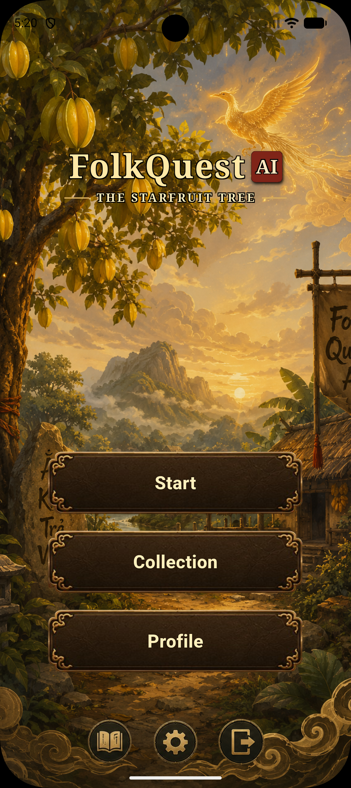
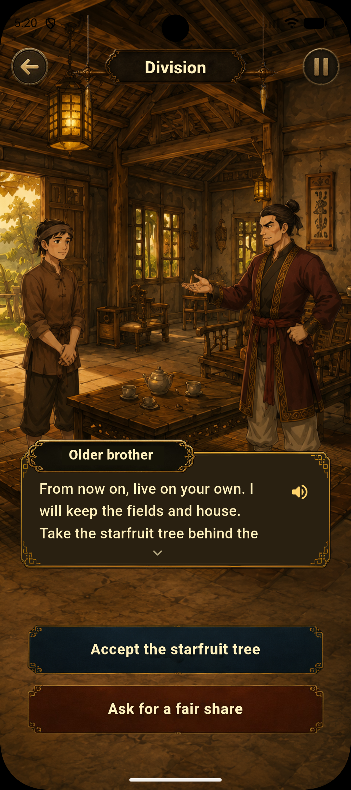
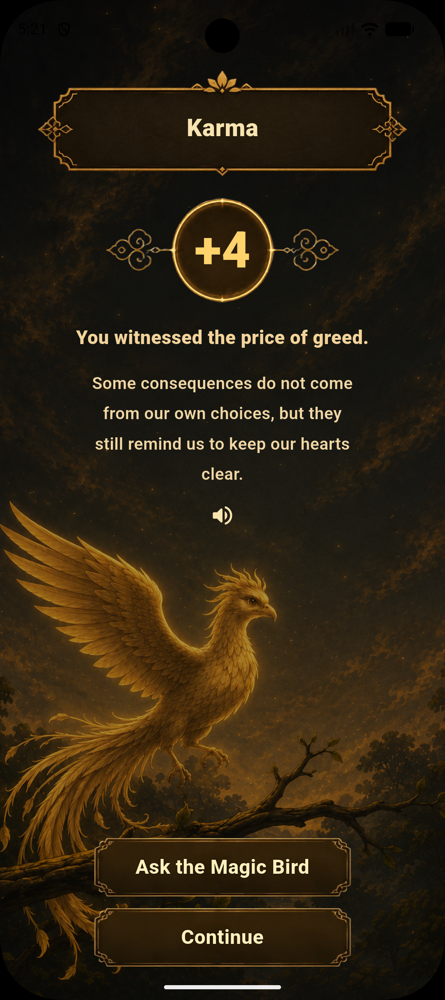
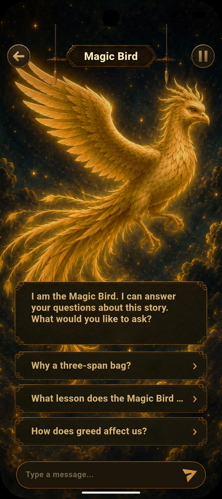
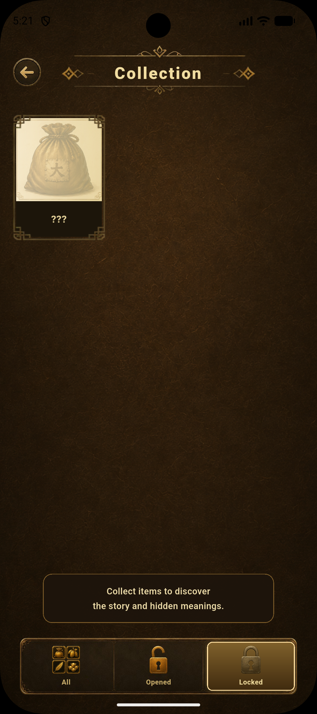
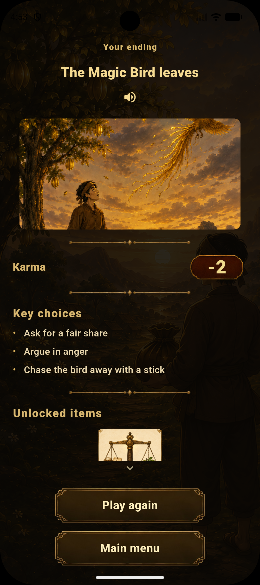
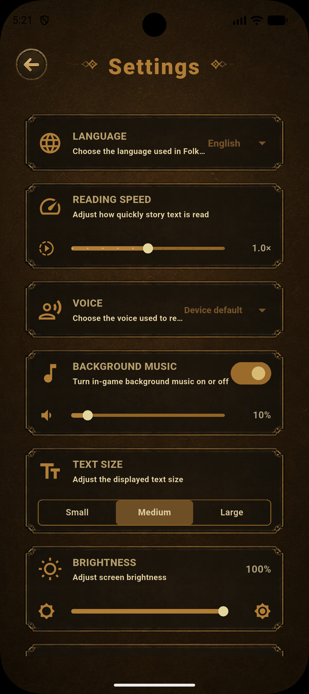
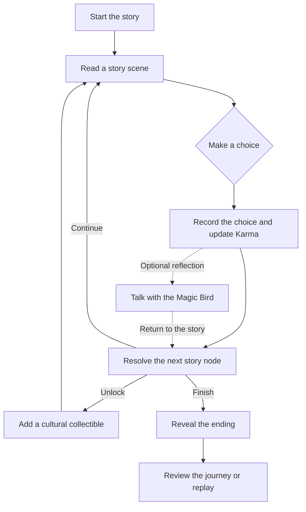

<div align="center">
  

  <h1>FolkQuest AI</h1>

  <p><strong>Interactive Vietnamese folktales, shaped by every choice.</strong></p>
  <p>
    Step into <em>Ăn khế trả vàng</em> (<em>The Starfruit Tree</em>), make meaningful choices, and discover how your decisions shape the story through the Karma system.
  </p>

  <p>
    
    
    
    
    
  </p>
</div>

---

## Product preview

<p align="center">
  
</p>

<table align="center">
  <tr>
    <th align="center">Story choices</th>
    <th align="center">Karma reflection</th>
    <th align="center">Magic Bird AI</th>
  </tr>
  <tr>
    <td align="center"></td>
    <td align="center"></td>
    <td align="center"></td>
  </tr>
</table>

<table align="center">
  <tr>
    <th align="center">Collection</th>
    <th align="center">Your ending</th>
    <th align="center">Settings</th>
  </tr>
  <tr>
    <td align="center"></td>
    <td align="center"></td>
    <td align="center"></td>
  </tr>
</table>

<p align="center">
  <a href="#about-the-project">About</a> ·
  <a href="#key-features">Features</a> ·
  <a href="#how-it-works">How it works</a> ·
  <a href="#getting-started">Getting started</a> ·
  <a href="#project-architecture">Architecture</a>
</p>

---

## About the project

FolkQuest AI is a choice-driven storytelling game inspired by Vietnamese folk culture. The current adventure retells **The Starfruit Tree**, placing the player inside the story instead of asking them to watch from the outside.

Each decision can change the narrative branch, Karma score, unlocked cultural objects, and final ending. The result is a replayable experience that connects traditional storytelling with modern interaction, accessibility, and contextual AI conversation.

## Key features

| Feature | Experience |
| --- | --- |
| **Branching story** | Choices lead to different scenes, consequences, and endings. |
| **Karma system** | Important decisions change the player's Karma and frame the lesson behind each path. |
| **Magic Bird AI** | Signed-in players can discuss the story, their choices, and its themes with an in-character guide. |
| **Cultural collection** | Story paths unlock illustrated objects connected to Vietnamese culture. |
| **Local and cloud progress** | Progress is kept locally and can sync to Cloud Firestore after sign-in. |
| **Vietnamese and English** | The interface and story content are available in both languages. |
| **Accessible playback** | Text-to-speech, reading-speed controls, scalable text, brightness, music, and reduced motion support different play styles. |

## How it works



The story repository defines scenes, choices, localized content, and branch conditions. `GameController` applies each decision and coordinates Karma, progress, collectibles, AI context, and navigation.

## Tech stack

| Layer | Technology | Purpose |
| --- | --- | --- |
| App | Flutter, Dart | Cross-platform interface and game logic |
| Authentication | Firebase Authentication, Google Sign-In | Player identity and protected features |
| Cloud data | Cloud Firestore | Progress synchronization and demo AI configuration |
| Local data | SharedPreferences | Offline-first game progress and settings |
| AI | OpenAI-compatible chat-completions API | Contextual Magic Bird conversations |
| Audio | `flutter_tts`, `audioplayers` | Narration, speech settings, and background music |

---

# Getting started

## 1. Prerequisites

For the core app:

- Flutter stable with a Dart SDK compatible with `^3.11.5`
- Android Studio or VS Code with the Flutter tooling
- Android SDK and an Android device or emulator

For Firebase provisioning or rule deployment, also install the [Firebase CLI](https://firebase.google.com/docs/cli) and [FlutterFire CLI](https://firebase.flutter.dev/docs/cli/).

Check the development environment:

```powershell
flutter doctor -v
flutter devices
```

## 2. Install the project

```powershell
git clone https://github.com/kaito0311/FolkQuestAI.git
cd FolkQuestAI
flutter pub get
```

## 3. Configure Firebase

The app can preserve progress locally when Firebase is unavailable. Google Sign-In, cloud synchronization, and remote Magic Bird chat require a configured Firebase project.

1. Create or select a Firebase project.
2. Register an Android app with package name `com.folkquest.ai`.
3. Enable **Google** in Firebase Authentication.
4. Add the Android app's SHA-1 and SHA-256 fingerprints.
5. Generate the platform configuration:

```powershell
flutterfire configure --project=<FIREBASE_PROJECT_ID> --platforms=android,web
```

6. Deploy the repository's Firestore rules:

```powershell
firebase use <FIREBASE_PROJECT_ID>
firebase deploy --only firestore:rules
```

FlutterFire generates `lib/firebase_options.dart` and the Android setup writes `android/app/google-services.json`. Keep project-specific credentials and signing material out of public commits.

## 4. Configure Magic Bird AI

Remote chat reads its demo configuration from this Firestore document:

```text
app_config/openrouter
```

| Field | Required | Description |
| --- | :---: | --- |
| `hostUrl` | Yes | OpenAI-compatible chat-completions endpoint |
| `model` | No | Provider model ID; the app contains a demo fallback |
| `apiKey` | Yes | Provider API key used by the demo client |

The included Firestore rules allow authenticated users to read this document and prevent client writes.

## 5. Run the app

Run on a connected Android device or emulator:

```powershell
flutter run
```

Run the web build for interface testing:

```powershell
flutter run -d chrome
```

## 6. Build the APK

After Firebase and Android release signing are configured:

```powershell
flutter build apk --release
```

The release artifact is written to:

```text
build/app/outputs/flutter-apk/app-release.apk
```

---

# Project architecture

## Project structure

```text
lib/
├── app/             App composition and top-level navigation
├── controllers/     Game state, decisions, and player actions
├── core/            Theme, localization, and asset paths
├── models/          Story, player, ending, and collection models
├── repositories/    Vietnamese and English story definitions
├── screens/         Feature and story screens
├── services/        Authentication, AI chat, and text-to-speech
├── stores/          Local, cloud, and hybrid progress persistence
├── widgets/         Reusable and responsive UI components
├── firebase_options.dart
└── main.dart

assets/              Runtime artwork and audio
android/             Android application and build configuration
test/                Unit and widget tests
web/                 Web runner and mirrored debug assets
```

## Runtime responsibilities

| Component | Responsibility |
| --- | --- |
| `StoryRepository` | Supplies localized story nodes, choices, collectibles, and endings. |
| `GameController` | Owns the active run, applies choices, updates Karma, and drives navigation. |
| `ProgressStore` | Defines persistence; local, Firestore, and hybrid implementations sit behind it. |
| `AuthService` | Abstracts Firebase/Google authentication and signed-out fallback behavior. |
| `BirdChatService` | Builds story-aware prompts and communicates with the configured AI provider. |
| `TextToSpeechService` | Provides localized narration and voice/rate controls. |

## Authentication and progress

Progress is local-first. `SharedPreferencesProgressStore` keeps the app playable while signed out; `HybridProgressStore` merges local and Firestore progress when a player signs in. Cloud records are scoped by Firebase UID through `firestore.rules`.

## Quality checks

Run formatting, static analysis, and the complete test suite before handing off a change:

```powershell
dart format lib test
flutter analyze
flutter test
```

The tests cover story branching, Karma rules, collectibles, endings, progress synchronization, text-to-speech rates, navigation, settings, and responsive layouts.

## Platform scope

| Platform | Status |
| --- | --- |
| Android | Primary target |
| Web | Development and interface testing |
| iOS | Present as Flutter scaffolding, but outside the current delivery scope |

## License

This project is licensed under the [Apache License 2.0](LICENSE).
